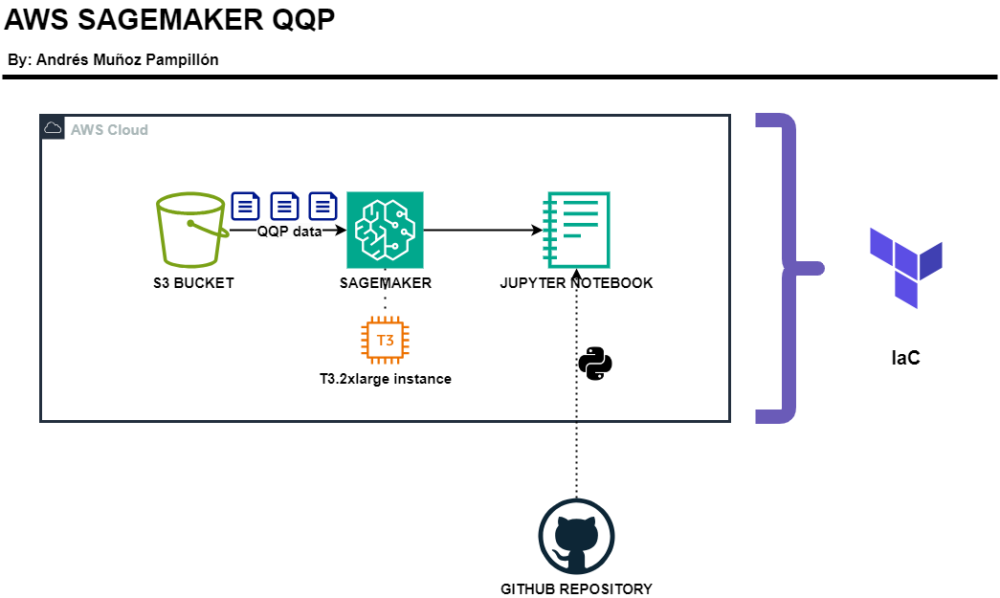

# AWS SAGEMAKER QQP

In this Python project with AWS, I show a solution to the need for exploratory data analysis (EDA) on the available information from "Quién es Quién en los Precios" by the Government of Mexico. This is a database that collects and monitors the prices of various products sold by large retailers, supermarkets, and small establishments.

## METHODOLOGY

To accomplish the proposed task, I decided to work with AWS. The technologies used include:
- Python: Language used for EDA
- S3: Storage
- SageMaker: Running JupyterLab
- GitHub: Remote repository
- Terraform: Deploying AWS infrastructure

-----



### Python

Since I need to work with Pandas and perform Exploratory Data Analysis on .csv files, Python is used in conjunction with libraries such as Pandas, Seaborn, and Matplotlib to work with dataframes and create visualizations.

### S3

In S3, various .csv files containing the "Quién es Quién en los Precios" information are stored. These files range between 100 and 200 MB, with 2 files for each month.

### SageMaker - Notebooks

In AWS, the SageMaker service allows the execution of Jupyter Notebooks, which run on an instance with JupyterLab. For this project, I choose to use the T3.2xlarge instance, which offers 8 vCPUs and 32 GiB of memory for only $0.399 per hour (it's important to turn off the instance when not in use to reduce costs).

### GitHub

Having version-controlled code is important, so GitHub is used for this purpose. This allows for version control of the code within the SageMaker Notebook. **Para realizar un push de Github desde la instancia con Sagemaker es recomendable utilizar un Personal Access Token (PAT) y no la contraseña.

### Terraform

To deploy the AWS services, Terraform was used. Replicating this setup is very easy.

You just need to fork this repository. Once cloned locally, in the `terraform/` folder, you need to create a file called `values.tfvars` with the following data:

```sh
# Variables for deployment
bucket_name = YOUR_BUCKET_NAME
role_arn    = SAGAMEKER_ARN_ROLE
github_repo = YOUR_GITHUB_REPO_URL
```
To deploy, simply run:
```sh
terreform init
terraform plan --out deploy --var-file values.tfvars
terraform apply deploy
```
## Presentation

The presentation can be accessed [aqui](https://drive.google.com/drive/folders/1CdghLlAUEsboDbKWdL4oCZGUmIoalfOZ?usp=sharing)
